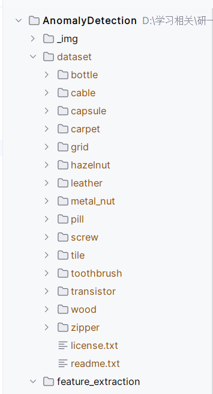
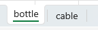

# Instruction
## Install python packages
```bash
    pip install -r requirements.txt
```
## Dataset downloads
Due to the size of dataset, it is not included in this repo. You have to manually download it and extract it into a folder called `dataset`. 
`dataset` folder is ignored by git in this repo.



## Feature extraction
### Output
After extracted features using HOG or SIFT, save the feature vector into:

1. `feature_extraction/output/hog_descriptors_good.xlsx`: Extracted HOG Descriptor of train data
2. `feature_extraction/output/sift_descriptors_good.xlsx`: Extracted SIFT Descriptor of train data
3. `feature_extraction/output/hog_descriptors_bad.xlsx`: Extracted HOG Descriptor of test data
4. `feature_extraction/output/sift_descriptors_bad.xlsx`: Extracted SIFT Descriptor of test data

Using the `save_feature_to_excel` function in `utils/feature`. 
Since dataset contain several categories (bottle, screw, tile...etc), you have to specify which category to save into which 
will save it to corresponding sheet in Excel file.

### Saved feature Excel file
Each Excel file separate data categories into different excel sheet (bottle, tile, screw...etc). 
Please be noted which category that your extracted feature belong to.



## Model Training

